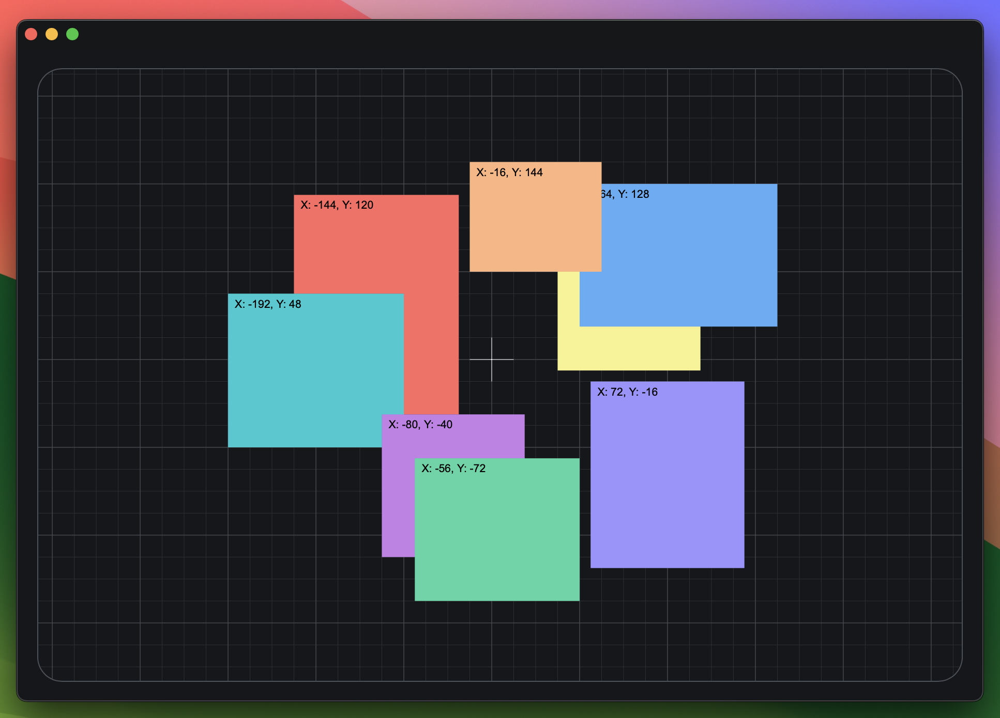

# Grid Canvas Starter
**Try It:** https://zacheryvaughn.github.io/GridCanvasStarter/
___
**Features:**
- Centered Origin
- Dynamic Gridlines
- Canvas Drag-Panning
- Cursor-Focused Zoom
- Snap-to-Grid Dragging
- Auto Z-Index Swapping

___
**Controls:**
- Scroll Wheel: Zoom Canvas
- Hold Left Mouse Button: Move Item
- Hold Right Mouse Button: Move Canvas
- Click Scroll Wheel Button: Re-Center Canvas

